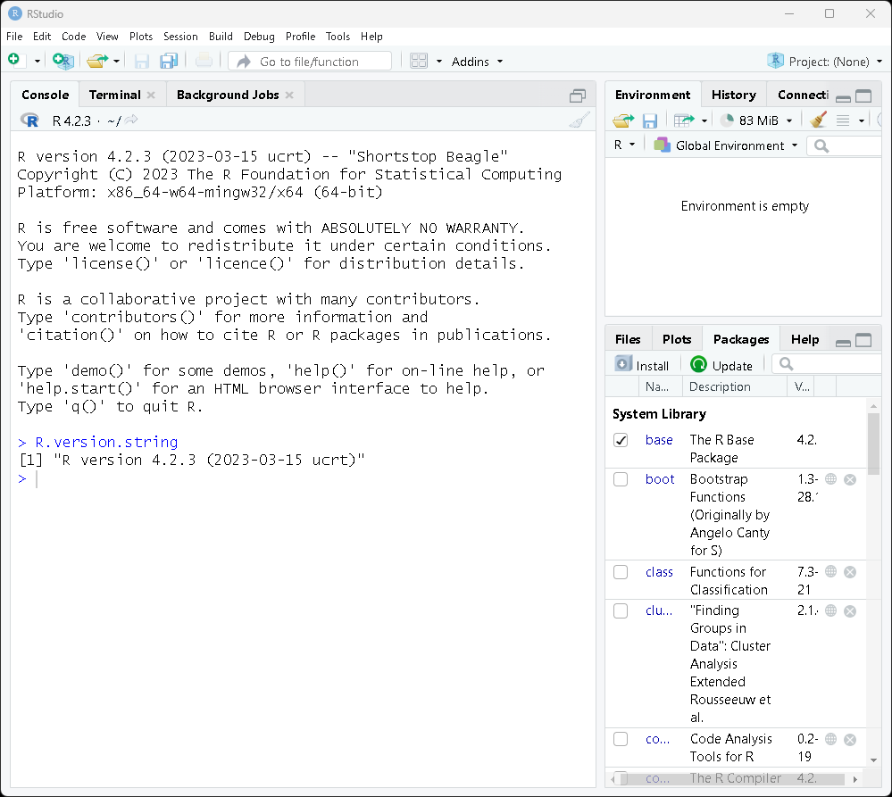

# RStanのインストール for Windows

このガイドは，2024年5月21日に更新されました．
Windows11で確認しています．

参考：[github/Rstan Getting Started](https://github.com/stan-dev/rstan/wiki/RStan-Getting-Started)


# STEP 1:ユーザ名とアカウント権限の確認

### for windows 10

次のリンク先にある，「インストール前の確認」をよく読み，問題ないことを確認してください．
誤ったユーザ名やアカウントを使った場合，RStanのインストールに失敗します．

- [for Windows10](https://github.com/yyamnk/DataAnalysis/blob/master/install/windows10.md#%E3%82%A4%E3%83%B3%E3%82%B9%E3%83%88%E3%83%BC%E3%83%AB%E5%89%8D%E3%81%AE%E7%A2%BA%E8%AA%8D): 

### for windows 11

次の2点を確認してください．

- [R, RstudioのインストールのSTEP1-1](https://github.com/yyamnk/DataAnalysis/blob/master/install/windows11_2023.md#step-1-%E3%82%A4%E3%83%B3%E3%82%B9%E3%83%88%E3%83%BC%E3%83%AB%E5%89%8D%E3%81%AE%E6%BA%96%E5%82%99)を参照し，ユーザフォルダの表示名に，全角文字が含まれていないこと．
- [R, RstudioのインストールのSTEP1-2](https://github.com/yyamnk/DataAnalysis/blob/master/install/windows11_2023.md#step-1-2-%E7%AE%A1%E7%90%86%E8%80%85%E6%A8%A9%E9%99%90%E3%81%AE%E7%A2%BA%E8%AA%8D%E3%81%A8%E5%A4%89%E6%9B%B4)を参照し，管理者権限があること．


# STEP 2: パッケージのインストール先の確認

1. RStudioの右下にあるPackagesタブを開く
2. Installタブを開く
    
3. Install to Libraryを確認
    - `Install to Library`の表示が，`C:/Users/ユーザ名/AppData/Local/R/win-library/バージョン番号` となっていることを確認．
        - `ユーザ名`と`バージョン番号`は各自で異なるので，適宜読み替えること．
    


# STEP 3: Rtoolsをインストールする

1. 図のように，RStudioのコンソールに
    ```r
    R.version.string
    ```
    と打ち込み，使用しているRのバージョンを確認する．
    

- 使用しているのが，R4.4.xだった場合（xは任意）
    - [Rtools4.4の配布元ページ](https://cran.r-project.org/bin/windows/Rtools/rtools44/rtools.html)にアクセスし，`Rtools44 installer`のリンクからインストーラをダウンロードする．
        
    - ダウンロードしたインストーラ`rtools44-XXXX-XXXX.exe`を実行する．
    - 選択肢は全てデフォルトのまま，インストールする

- 使用しているのが，R4.3.xだった場合（xは任意）
    - [Rtools4.3の配布元ページ](https://cran.r-project.org/bin/windows/Rtools/rtools43/rtools.html)にアクセスし，`Rtools43 installer`のリンクからインストーラをダウンロードする．
        
    - ダウンロードしたインストーラ`rtools43-XXXX-XXXX.exe`を実行する．
    - 選択肢は全てデフォルトのまま，インストールする

- 使用しているのが，R4.2.xだった場合（xは任意）
    - [Rtools4.2の配布元ページ](https://cran.r-project.org/bin/windows/Rtools/rtools42/rtools.html)にアクセスし，`Rtools42 installer`のリンクからインストーラをダウンロードする．
        
    - ダウンロードしたインストーラ`rtools42-XXXX-XXXX.exe`を実行する．
    - 選択肢は全てデフォルトのまま，インストールする


# STEP 4: Rstanのパッケージをインストールする．

1. Rstudioのコンソールに，
    ```r
    install.packages("rstan", repos = "https://cloud.r-project.org/", dependencies = TRUE)
    ```
    と打ち込み，インストールする．
    このとき，「パッケージのソースからインストールを行いますか？（コンパイルが必要です）」というダイアログが出たら，はい（Y）を選ぶ．

# STEP 5: rstanの動作確認

Rstudioのコンソールに，
```r
library(rstan)
(stan(model_code="parameters {real p;} model {p~normal(0,1);}"))
```
と打ち込む．

実行に時間がかかるので，しばらく待つ．
正常に完了すると，以下のように表示されるはず．これが表示されればrstanは正常にインストールできている．


# よくあるエラーとその対処法

## 事例1: Rtoolsのインストールができていない

- エラーの例
    - Rstudioのコンソールに以下のように表示される．
    ```r
    WARNING: Rtools is required to build R packages, but is not currently installed.

    Please download and install Rtools 4.2 from https://cran.r-project.org/bin/windows/Rtools/ or https://www.r-project.org/nosvn/winutf8/ucrt3/.
    WARNING: Rtools is required to build R packages, but is not currently installed.
    ```

- 対処方法: Rtoolsとパッケージの再インストール

1. 一度，rstanをアンインストールする．Rstudioのコンソールに，
    ```r
    remove.packages("rstan")
    if (file.exists(".RData")) file.remove(".RData")
    ```
    と打ち込む．
2. 既存のRtools（がある場合は）アンインストールする．
    - 方法は，[RとRstudioのアンインストール方法 > windows11](https://github.com/yyamnk/DataAnalysis/blob/master/uninstall/windows11.md)に書いてある通り．
    - 検索しても既存のRtoolsがない場合は，次のステップに進む．
3. （念のため）PCを再起動する．
4. Rtoolsをインストールし，`rstan`パッケージをインストールする．
    - 方法は，このページに書いてある通り


## 事例2: Rtoolsはインストールできているが，rstanが実行できない

事例1のエラーが出ないものの，他の何らかの原因で，`rstan`のインストールに失敗している場合があります．

- 対処方法: `rstan`のみを再インストール

1. 一度，rstanをアンインストールする．Rstudioのコンソールに，
    ```r
    remove.packages("rstan")
    if (file.exists(".RData")) file.remove(".RData")
    ```
    と打ち込む．
2. 念のためRStudioを再起動する．
3. 上記のSTEP4に従ってrstanをインストールする．このとき，
    ```r
    install.packages("rstan", repos = "https://cloud.r-project.org/", dependencies = TRUE)
    ```
    を実行後に，「パッケージのソースからインストールを行いますか？（コンパイルが必要です）」というダイアログが出たら，はい（Y）を選ぶ．


## 上記の方法でも解決できない場合の対処法

以下は上級者向けです．
以下の対処をする前に，まずは教員へ相談することをおすすめします．

1. RとRtoolsのアンインストール
    - 方法は，[アンインストール方法](../uninstall/readme.md)を参照
2. 既存のRに関連するフォルダを削除する．
    - `C:/Users/ユーザ名/AppData/local/R`の削除
        - `ユーザ名`は各自で異なるので，適宜読み替えること．
    - `C:\rtools44`または`C:\rtools43`，`C:\rtools42`の削除
3. Rの再インストール
4. 上記のSTEP3以降を実行
